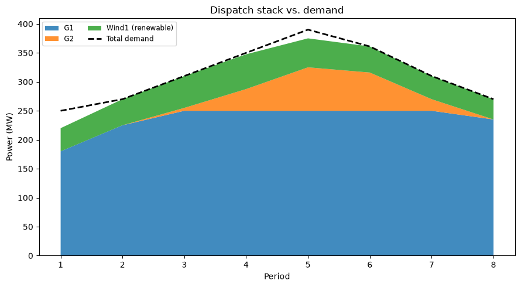

# Economic Dispatch with Pyomo

Multi-period, multi-bus DC-OPF Economic Dispatch, built with
[Pyomo](https://www.pyomo.org/). Supports transmission-constrained
dispatch, generator ramping, curtailable renewables, and storage, with a
selectable quadratic or piecewise-linear cost model per generator.

> Built incrementally, phase by phase — see `PROJECT_BRIEF.md` for the
> design rationale behind each phase and `docs/formulation.md` for the
> full mathematical formulation.

## Features

- **DC-OPF network layer** — nodal power balance, line flow via bus
  angles, thermal line limits, and locational marginal prices (LMPs)
  extracted directly from constraint duals.
- **Multi-period dispatch with ramping** — inter-temporal ramp-up /
  ramp-down limits per generator.
- **Renewables** — curtailable, forecast-bounded dispatch.
- **Storage** — state-of-charge dynamics with charge/discharge
  efficiency.
- **Two cost models, selectable per generator** — quadratic (QP, solved
  with Ipopt) or piecewise-linear with non-decreasing marginal cost (LP,
  solved with HiGHS). `recommended_solver()` picks the right one
  automatically based on the system's generator mix.
- **Validated data model** — a `System` fails loudly at construction
  time (unreachable buses, demand exceeding capacity, malformed cost
  segments, etc.) rather than surfacing as an opaque solver infeasibility.

## Install

```bash
pip install -e ".[dev,solvers,viz]"
```

Requires a solver: [HiGHS](https://highs.dev/) (installed via the
`solvers` extra, `highspy`) for LP-only systems, and
[Ipopt](https://coin-or.github.io/Ipopt/) for any system with a
quadratic-cost generator. Ipopt is not available via pip on all
platforms — see `.github/workflows/ci.yml` for a conda-based install.

If you do not have Ipopt, use
`data/ieee_case_examples/example_3bus_piecewise.json`. It is the same 3-bus
network with every generator on the piecewise-linear cost model, which makes it
a pure LP that HiGHS solves on its own — `recommended_solver()` will tell you so.

## Quickstart

```python
from ed_model.data.schema import Bus, Generator, System
from ed_model.model.builder import build_ed_model
from ed_model.solve import solve_ed, recommended_solver

system = System(
    buses=[Bus(name="A", is_reference=True)],
    generators=[
        Generator(name="G1", bus="A", p_min=0, p_max=200, c2=0.01, c1=10, c0=0),
        Generator(name="G2", bus="A", p_min=0, p_max=200, c2=0.02, c1=8, c0=0),
    ],
    demand={"A": [150]},
)

model = build_ed_model(system)
result = solve_ed(model, solver_name=recommended_solver(system))

print(result.dispatch_for_period(1))
print(result.total_cost)
```

## What it produces

```python
from ed_model.viz import plot_dispatch_stack

plot_dispatch_stack(system, result).savefig("dispatch_stack.png")
```



The eight-period piecewise example, solved. G1 is the cheaper unit and fills up
to its 250 MW cap by period 3, after which the more expensive G2 covers the peak;
wind sits on top, taken in full because its marginal cost is zero.

Where the demand line runs above the stack — periods 1, 4 and 5 — the difference
is the battery discharging. `plot_dispatch_stack` stacks generation and
renewables only, so storage shows up as the gap rather than as a band.

`plot_lmp_heatmap`, `plot_storage_soc`, and `plot_line_loading` cover locational
prices, state of charge, and which lines are binding.

## Repo layout

```
economic-dispatch-pyomo/
├── src/ed_model/
│   ├── data/schema.py      # Bus, Line, Generator, Renewable, Storage, System
│   ├── data/loaders.py     # JSON loading
│   ├── model/builder.py    # Pyomo ConcreteModel construction
│   ├── model/objective.py  # quadratic / piecewise cost strategies
│   ├── solve.py            # solver interface, DispatchResult, recommended_solver()
│   └── viz.py               # dispatch stack, LMP heatmap, SOC, line loading plots
├── notebooks/01_walkthrough.ipynb
├── app/streamlit_app.py    # interactive 2-bus demo
├── tests/
├── docs/                   # formulation.md, images/
└── .github/workflows/ci.yml
```

## Interactive demo

```bash
streamlit run app/streamlit_app.py
```

## Tests

```bash
pytest -v
```

## Known simplifications

No unit commitment, no storage degradation cost, no non-convex
(valve-point) cost curves, DC (lossless) power flow only. Full list with
rationale in `docs/formulation.md`.

## Companion repos

Five standalone optimization models built to the same conventions — validated
dataclasses that fail loudly at construction, a Pyomo builder that never touches
raw files, and a result dataclass rather than a live model — but sharing no code.

- [battery-storage-optimization-pyomo](https://github.com/Ahmadmohammadip/battery-storage-optimization-pyomo)
  — battery energy arbitrage co-optimized with frequency regulation
  capacity (revenue stacking) as a single LP.
- [cvrp-optimization-pyomo](https://github.com/Ahmadmohammadip/cvrp-optimization-pyomo)
  — exact MILP for the Capacitated Vehicle Routing Problem, with a
  measured benchmark of where exact methods stop scaling.
- [supply-chain-network-optimization-pyomo](https://github.com/Ahmadmohammadip/supply-chain-network-optimization-pyomo)
  — multi-echelon network design and production-distribution-inventory
  planning as one MILP: which plants and warehouses to open, and how to
  run them.
- [forecast-driven-bess-dispatch](https://github.com/Ahmadmohammadip/forecast-driven-bess-dispatch)
  — ML forecasts of load, PV and price feeding a Pyomo dispatch LP for a
  behind-the-meter battery, measuring what the forecast is actually worth.

## License

MIT — see `LICENSE`.
